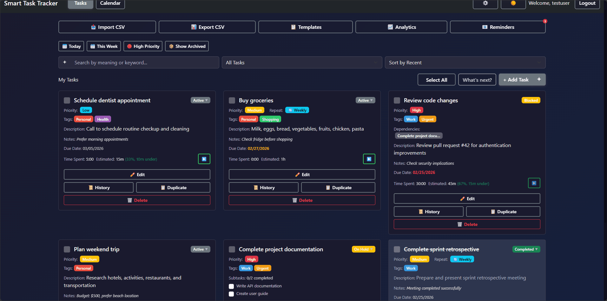
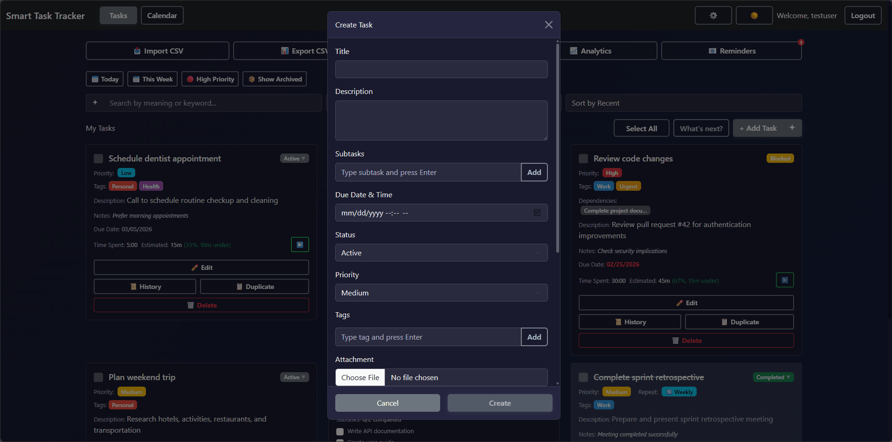
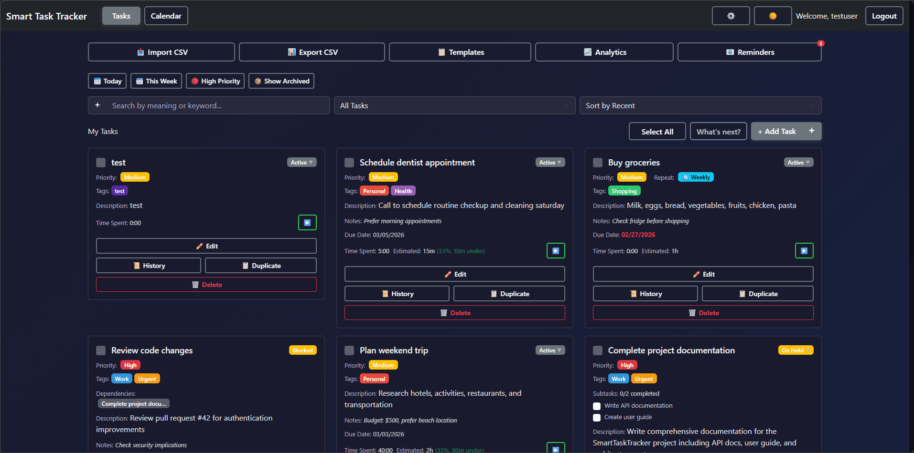
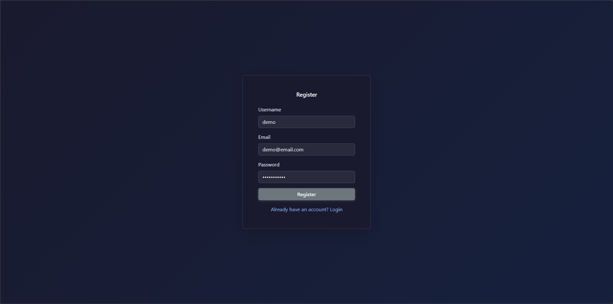
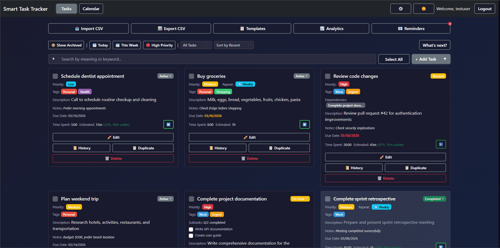

# SmartTaskTracker

Full-stack task app — React + ASP.NET Core 9, JWT auth, SQLite/PostgreSQL. Run locally, test features, deploy (Netlify + Render). See below.

**Live:** [Frontend](https://smarttasktracker.netlify.app/) · [Backend](https://smarttasktracker-kue7.onrender.com)

---

## Demo

### AI features ([docs/AI.md](docs/AI.md)):

| Feature | GIF | Steps |
|--------|-----|-------|
| **Semantic search** |  | Type in search (e.g. `meetings`, `things to discuss with the team`) → results by meaning; keyword fallback when no semantic match. |
| **Add from text** |  | + Add Task → sparkle (✦) → e.g. `Review report by Friday, high priority` → Add from text → modal pre-filled → Create. |
| **Smart tagging** |  | Create/edit task → type title/description similar to existing tasks → “From similar tasks:” suggestions → click to add. |
| **Dependency suggestions** |  | Edit task → Depends On → “From similar tasks” → click to add dependency → Save. |

### Core & workflow

| Feature | GIF | Steps |
|--------|-----|-------|
| **What's next?** |  | Click "What's next?" → panel with suggested tasks + reason (DB ranking) → click title to open edit modal. |
| **Auth** |  | Register (e.g. `demo` / `demo@example.com` / `password123`) → Login → land on Tasks. One sample task is created on register (all fields "Sample" prefixed; no dependencies). |
| **CRUD** |  | Add task (all fields: title, description, due, priority, status, tags, notes, recurrence, file, estimate, subtask, dependency). Edit once → change several fields → Save. Toggle complete → Delete. |
| **Search** |  | Type in search box → results (keyword fallback when no semantic match). |
| **Filters & sort** |  | Today / This Week / High Priority; status filter; sort. Settings → Filter Preset → create → apply on Tasks. |
| **Bulk** |  | Select 2 tasks → Change Status → Completed. Select → Delete Selected. Select All → Clear. |
| **Export / Import** |  | Export CSV (with/without selection). Import CSV (sample file). |
| **Extras** |  | Recurring → complete → next occurrence. Save as template → use template. Duplicate task. Calendar, Reminders, Analytics. Time tracking, History (📜), Estimates. |
| **UI** |  | Dark mode, Settings → accent. Shortcuts: `n`, `s`, `/`. Notifications. Archive → Show Archived → Unarchive. |

Full checklist: [docs/TESTING.md](docs/TESTING.md).

---

## Quick Start

**Prerequisites:** .NET 9 SDK, Node.js 18+

| Step | Backend | Frontend |
|------|---------|----------|
| Setup | `cd backend/SmartTaskTracker.API` → create `appsettings.Development.json` with `Jwt:Key` (min 32 chars) or set `JWT_KEY` env. For semantic search (local): set `TaskMemory:ApiKey` to your [Hugging Face token](https://huggingface.co/settings/tokens) (or env `TASKMEMORY_API_KEY` / `HF_TOKEN`) | `cd frontend` → `npm install` |
| Run | `dotnet run` → http://localhost:5000 | `npm run dev` → http://localhost:5173 |
| Test | `cd backend/SmartTaskTracker.API.Tests` → `dotnet test` | `cd frontend` → `npm test` |

Swagger: http://localhost:5000/swagger (dev only)

---

## Docs

| Doc | When to use |
|-----|--------------|
| [docs/TESTING.md](docs/TESTING.md) | Manual test checklist (all features) |
| [docs/DEPLOYMENT.md](docs/DEPLOYMENT.md) | Deploy to Netlify + Render |
| [docs/AI.md](docs/AI.md) | AI plan (semantic search, NL task creation, etc.) |
| [docs/REFERENCE.md](docs/REFERENCE.md) | DB schema, backend setup, unit test todos |

---

## Project layout (detailed)

What exists and where to look.

### Root
```
SmartTaskTracker/
  README.md              ← you are here
  .gitignore             Git ignore rules
  .env                   Local frontend env (optional; VITE_API_URL fallback in api.js)
  render.yaml             Render backend + DB config (Blueprint); env vars set in dashboard for manual deploy
  netlify.toml           Netlify frontend build (base=frontend, publish=dist)
  docs/
    TESTING.md            Manual test checklist (all features)
    DEPLOYMENT.md         Deploy to Netlify + Render (step-by-step)
    AI.md                 AI plan: use cases + design + follow-the-code flows (semantic search, NL tasks)
    REFERENCE.md          DB schema summary, backend setup, unit test todos
```

### Frontend (`frontend/`)
```
frontend/
  index.html              HTML entry (favicon.svg)
  public/                 Static assets (favicon.svg); /favicon.ico → favicon.svg in dev
  package.json            Deps + scripts (dev, build, test)
  vite.config.js          Vite build config (+ favicon.ico rewrite)
  tailwind.config.js      TailwindCSS config
  postcss.config.js       PostCSS config
  src/
    main.jsx              App entry
    App.jsx               Root + routing
    App.css / index.css   Global styles
    components/           Reusable UI
      Navbar.jsx          Top nav + logout
      TaskCard.jsx        Single task display
      TaskModal.jsx       Create/edit task form
      ServerWakeBanner.jsx  Server cold-start banner + auto-retry (Render free tier)
      Dialog.jsx          Alerts, confirmations, prompts
      Dialog.css
      TaskHistory.jsx     Task audit log
    pages/                 Page views
      Login.jsx           Login form
      Register.jsx        Register form
      Tasks.jsx          Main tasks dashboard
      Calendar.jsx        Calendar view (tasks by due date)
      Settings.jsx        User settings + preferences
    contexts/              React state
      AuthContext.jsx     Auth state + login/logout/refresh
      ThemeContext.jsx    Dark/light + accent
    hooks/                 Custom hooks
      useTasks.js         Task CRUD + list state (search = semantic + keyword fallback)
      useSettings.js      Load/save user settings
      useDialog.js        Dialog open/close state
      useTimer.js         Time tracking timer
      useNotifications.js Browser notifications (overdue/upcoming)
      useKeyboardShortcuts.js  Shortcuts (e.g. n=new, s=search)
    services/              API clients (Axios)
      api.js              Axios instance + auth interceptors; checkServerUp(), server-waking/server-up/server-back
      authService.js      Register, login, refresh
      taskService.js      Task CRUD, search (keyword/semantic), ai-suggestions, parseNaturalLanguage
      taskTemplateService.js  Template CRUD
      tagService.js       Tag CRUD
      settingsService.js  User settings API
      analyticsService.js Analytics API
      reminderService.js  Reminders API
      taskHistoryService.js  Task history API
    utils/
      dateFormat.js       Date formatting
    test/
      setup.js            Vitest setup
    __tests__/            (inside contexts, hooks, services) Unit tests
```

### Backend (`backend/SmartTaskTracker.API/`)
```
backend/SmartTaskTracker.API/
  Program.cs               Entry + DI + CORS (FRONTEND_URL env) + DB init; seed if Development or SEED_DATABASE=true
  Dockerfile               Build/run for Render (Docker)
  appsettings.json         Config (DB only; JWT in appsettings.Development.json or env)
  SmartTaskTracker.API.csproj
  Controllers/             REST endpoints
    AuthController.cs      Register, login, refresh
    HealthController.cs    GET /api/health (no auth; cold-start check)
    TasksController.cs     Task CRUD, bulk, archive, subtasks, dependencies, import, search, ai-suggestions, from-natural-language
    TaskTemplatesController.cs  Template CRUD
    TagsController.cs      Tag CRUD
    SettingsController.cs  User settings
  Services/                 Business logic
    AuthService.cs         Auth + JWT + refresh
    TaskService.cs         Task logic
    TaskTemplateService.cs Template logic
    TagService.cs          Tag + color
    SettingsService.cs     User settings; ensures user exists before creating UserSettings (avoids FK + 401 when stale token)
    TaskMemoryService.cs   Semantic search (lazy embeddings)
    NaturalLanguageTaskService.cs  NL task parse (LLM + keyword fallback)
  Models/                   Domain entities
    User.cs                User + refresh token
    Task.cs                Task (priority, status, recurrence, etc.)
    TaskTemplate.cs
    Tag.cs                 Tag + color
    TaskDependency.cs      Task → Task
    TaskHistory.cs         Audit log row
    UserSettings.cs
  DTOs/                     Request/response shapes
    AuthDto.cs
    TaskDto.cs
    TaskTemplateDto.cs
    SettingsDto.cs
    ErrorDto.cs
    AnalyticsDto.cs
    ReminderDto.cs
    TaskHistoryDto.cs
    TaskSearchDto.cs       TaskSearchResultDto, TaskSuggestionDto
  Data/
    AppDbContext.cs         EF Core DbContext
    DbSeeder.cs             Dev seed data
  Helpers/
    JwtHelper.cs            JWT + refresh token generation
    JwtOptions.cs           JWT key/issuer/audience (resolved once in Program)
    TaskMapper.cs           Entity ↔ DTO
    TaskMemoryOptions.cs    TaskMemory + LLM config (provider, topK, cache, LlmProvider, LlmModel)
    TaskIntent.cs           Keyword, Semantic
    LRUCache.cs             LRU cache for embeddings
    NaturalLanguageParseHelper.cs  Date/time/priority/title/tags parsing (keyword fallback)
  Middleware/
    ErrorHandlingMiddleware.cs  Global error handling; auth exceptions (token expired, user not found) → 401
  Properties/
    launchSettings.json     Launch config
```

### Tests
```
backend/SmartTaskTracker.API.Tests/
  Services/
    AuthServiceTests.cs     Auth service unit tests
    TaskServiceTests.cs     Task service unit tests
  SmartTaskTracker.API.Tests.csproj
```

---

## Features (short)

Tasks: CRUD, priorities, tags, status, due dates, recurring, templates, subtasks, dependencies, time tracking, calendar, CSV import/export, search/filter/sort, bulk ops, keyboard shortcuts, dark mode, settings, browser notifications. **AI ([docs/AI.md](docs/AI.md)):** Semantic search, natural-language task creation, smart tagging, dependency suggestions (from similar tasks); see AI.md. **Render free tier:** First request may wake server (30–60s); app shows banner and auto-retries. 401 → clear session, redirect to login.

---

## Deploy

**Backend (Render):** Docker build from `backend/SmartTaskTracker.API` (see `Dockerfile`). Root Directory = `backend/SmartTaskTracker.API`, Environment = Docker. **Set in Render dashboard (Environment tab):** `JWT_KEY` (required, min 32 chars), `FRONTEND_URL` = your Netlify URL with `https://` (no trailing slash; required for CORS). PostgreSQL via Render free tier; `DATABASE_URL` auto-set if DB linked.

**Frontend (Netlify):** Base directory = `frontend`, publish = `dist`. **Set in Netlify:** `VITE_API_URL` = your Render API URL (e.g. `https://your-api.onrender.com/api`).

**CORS:** Backend allows only origins from `FRONTEND_URL` (and localhost). `FRONTEND_URL` must match the Netlify origin exactly (e.g. `https://smarttasktracker.netlify.app`).

**Optional:** `SEED_DATABASE=true` on Render resets the seed user and runs `DbSeeder` every startup; set to `false` when done — see [docs/DEPLOYMENT.md](docs/DEPLOYMENT.md).

Full steps: [docs/DEPLOYMENT.md](docs/DEPLOYMENT.md)

---

## License

MIT
