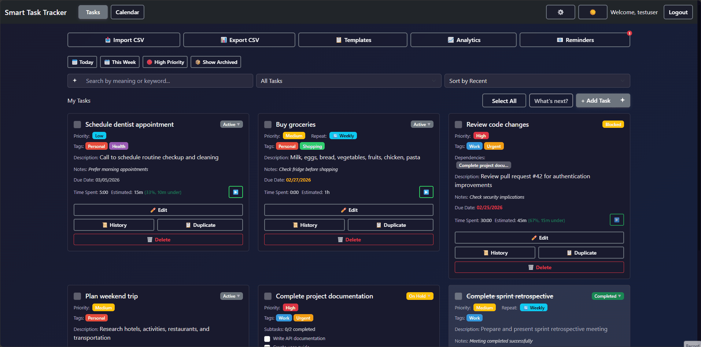
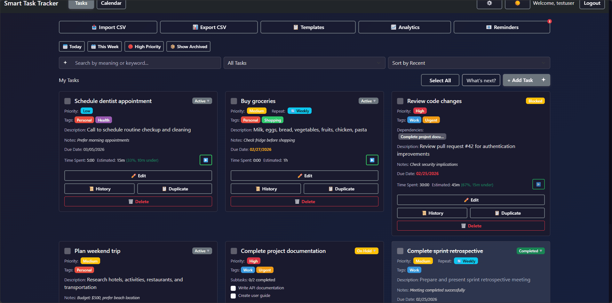
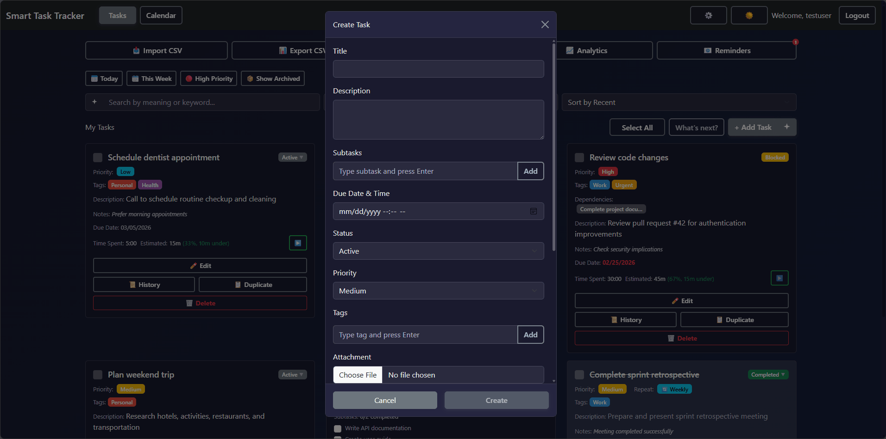
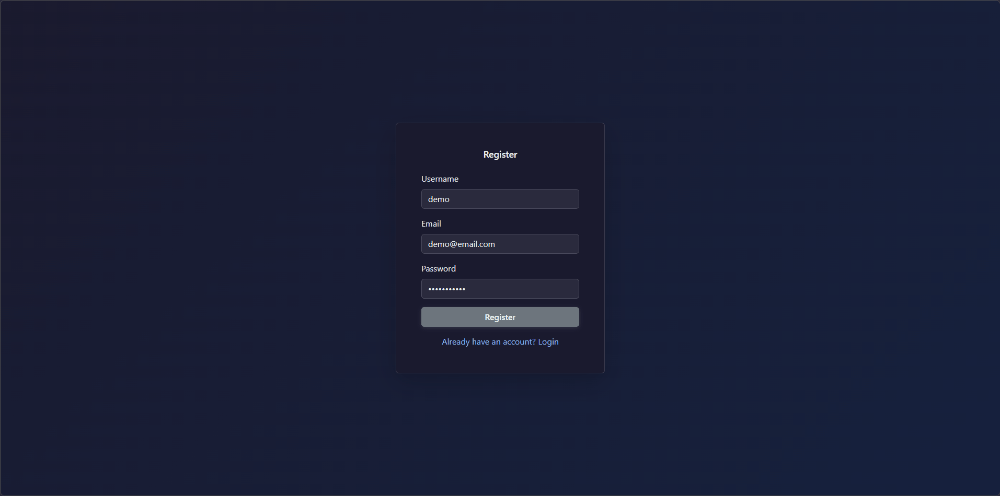
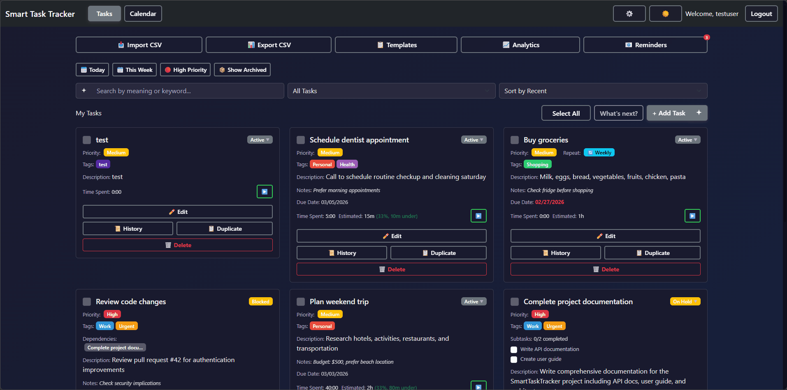
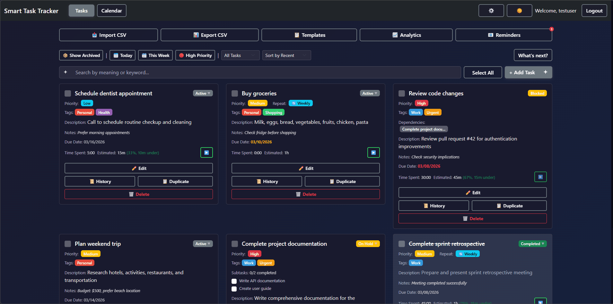

# SmartTaskTracker

Full-stack task management application built with **React** and **ASP.NET Core 9**. Features JWT authentication, rich task workflows, CSV import/export, and AI-powered search and task creation.

**Live:** [Frontend](https://smarttasktracker.netlify.app/) · [Backend API](https://smarttasktracker-kue7.onrender.com)

---

## Demo

### AI features

| Feature | GIF | Steps |
|--------|-----|-------|
| **Semantic search** |  | Search by meaning (e.g. `meetings`, `things to discuss with the team`); keyword fallback when no semantic match. |
| **Add from text** |  | + Add Task → AI menu → e.g. `Review report by Friday, high priority` → Add from text → Create. |
| **Smart tagging** |  | Create/edit task → similar titles/descriptions → "From similar tasks:" → click to add tag. |
| **Dependency suggestions** |  | Edit task → Depends On → From similar tasks → add → Save. |

### Core workflow

| Feature | GIF | Steps |
|--------|-----|-------|
| **Auth** |  | Register → Login → Tasks. Sample task created on register. |
| **CRUD** |  | Create, edit, complete, delete tasks (all fields). |
| **Search** |  | Search box → results (semantic or keyword). |
| **Filters & sort** |  | Quick filters, sort, presets, What's next? |
| **Bulk** |  | Select tasks → change status or delete. |
| **What's next?** |  | Suggested tasks with reason (database ranking). |
| **Export / Import** |  | CSV export and import. |
| **Extras** |  | Recurring, templates, calendar, reminders, analytics, time tracking. |
| **UI** |  | Dark mode, accent colors, shortcuts, notifications, archive. |

Full test checklist: [docs/project.md#manual-test-scenarios](docs/project.md#manual-test-scenarios)

---

## Quick start

**Prerequisites:** .NET 9 SDK, Node.js 18+

| Step | Backend | Frontend |
|------|---------|----------|
| Setup | `cd backend/SmartTaskTracker.API` → create `appsettings.Development.json` with `Jwt:Key` (min 32 chars). For AI locally: `TaskMemory:ApiKey` or `TASKMEMORY_API_KEY` | `cd frontend` → `npm install` |
| Run | `dotnet run` → http://localhost:5000 | `npm run dev` → http://localhost:5173 |
| Test | `cd backend/SmartTaskTracker.API.Tests` → `dotnet test` | `npm test` |

Swagger: http://localhost:5000/swagger (development only)

Setup and deployment details: [docs/project.md](docs/project.md)

---

## Documentation

| Document | Description |
|----------|-------------|
| [docs/docs.md](docs/docs.md) | Documentation index |
| [docs/project.md](docs/project.md) | Product scope, project layout, API, domain rules, tests, deployment |
| [docs/architecture.md](docs/architecture.md) | Engineering standard |
| [docs/ui.md](docs/ui.md) | Frontend layout, theme, components |

---

## Project structure

Detailed file tree (root, frontend, backend, tests): [docs/project.md#project-layout](docs/project.md#project-layout)

---

## Features

Task CRUD, priorities, tags, status workflows, due dates, recurring tasks, templates, subtasks, dependencies, time tracking, calendar view, CSV import/export, search and filters, bulk operations, keyboard shortcuts, dark mode, user settings, browser notifications.

**AI:** Semantic search, natural-language task creation, smart tagging, dependency suggestions. Details: [docs/project.md#ai-features](docs/project.md#ai-features)

**Production:** Netlify (frontend) and Render (backend). Free-tier cold starts show a wake-up banner with automatic retry.

---

## License

MIT
